# 🤖 MyTeam - AI Multi-Agent Parallel Execution System

[](https://opensource.org/licenses/MIT)
[](https://github.com/yourusername/myteam/stargazers)
[](https://github.com/yourusername/myteam/issues)
[](https://github.com/yourusername/myteam/pulls)
[](https://github.com/yourusername/myteam)

> 🚀 **Revolutionary AI team collaboration system** using Claude CLI and tmux for parallel project execution across development, marketing, planning, and analysis.

## 📋 Table of Contents

- [✨ Features](#-features)
- [🏗️ System Architecture](#️-system-architecture)
- [🚀 Quick Start](#-quick-start)
- [📦 Installation](#-installation)
- [💻 Usage](#-usage)
- [🤖 Agent Roles](#-agent-roles)
- [📞 Communication Protocol](#-communication-protocol)
- [🔧 Configuration](#-configuration)
- [📚 Documentation](#-documentation)
- [🤝 Contributing](#-contributing)
- [📄 License](#-license)
- [🙏 Acknowledgments](#-acknowledgments)

## ✨ Features

### 🎯 Core Capabilities
- **🔄 Parallel AI Execution**: 5 AI agents working simultaneously on complex projects
- **🧠 Dynamic Role Adaptation**: Agents adapt to project needs (development, marketing, analysis)
- **📈 Hierarchical Delegation**: CEO → Manager → Execution Agents workflow
- **⚡ Real-time Communication**: Inter-agent messaging with complete audit trails
- **🔄 Automatic Workflow**: Task dependency management and auto-progression
- **🛡️ Security-First**: Built-in security protocols and permission management

### 🎨 Advanced Features
- **📊 Task Dependency Analysis**: Parallel vs Sequential execution optimization
- **🔍 Quality Assurance**: Automated testing and validation workflows  
- **📝 Comprehensive Logging**: Full communication history and decision tracking
- **🔧 Flexible Architecture**: Supports any project type and scale
- **🌐 Cloud Integration**: Compatible with various cloud platforms and services

## 🏗️ System Architecture

```mermaid
graph TD
    A[🏢 CEO Agent<br/>ceo:0] -->|Delegates| B[👔 Manager Agent<br/>team:0.0]
    B -->|Assigns Tasks| C[👨‍💻 Dev Agent 1<br/>team:0.1<br/>UI/UX, Frontend]
    B -->|Assigns Tasks| D[👩‍💻 Dev Agent 2<br/>team:0.2<br/>Backend, Infrastructure]
    B -->|Assigns Tasks| E[🔧 Dev Agent 3<br/>team:0.3<br/>QA, Testing, Research]
    
    C -->|Reports| B
    D -->|Reports| B
    E -->|Reports| B
    B -->|Reports| A
    
    F[📝 Communication Log<br/>logs/communication.log] -.->|Records All| A
    F -.->|Records All| B
    F -.->|Records All| C
    F -.->|Records All| D
    F -.->|Records All| E
    
    style A fill:#ff9999
    style B fill:#99ccff
    style C fill:#99ff99
    style D fill:#99ff99
    style E fill:#99ff99
    style F fill:#ffff99
```



### 🔄 Execution Strategies

| Strategy | Use Case | Execution Pattern |
|----------|----------|-------------------|
| **🔄 Parallel** | Independent tasks | All agents work simultaneously |
| **➡️ Sequential** | Dependent tasks | Tasks execute in order |
| **🔀 Mixed** | Complex projects | Staged parallel + sequential |

## 🚀 Quick Start

### ⚡ 30-Second Setup

```bash
# Clone the repository
git clone https://github.com/yourusername/myteam.git
cd myteam

# Start the AI team system
./start-ai-team.sh

# Initialize all agents
./initialize-agents.sh

# Connect to CEO for project delegation
tmux attach -t ceo
```

### 🎬 Demo Usage

```bash
# Send a project to your AI team
./send-message.sh ceo "Create a web application with user authentication"

# Monitor the team workspace
tmux attach -t team

# View communication logs
tail -f logs/communication.log
```

## 📦 Installation

### 📋 Prerequisites

- **Claude CLI**: Latest version with API access
- **tmux**: Terminal multiplexer (v3.0+)
- **Bash**: Unix shell (v4.0+)
- **Git**: Version control system

### 🔧 Step-by-Step Installation

#### 1. **Claude CLI Setup**
```bash
# Install Claude CLI (if not already installed)
# Follow official Claude CLI installation guide
claude --version
```

#### 2. **System Dependencies**
```bash
# macOS
brew install tmux

# Ubuntu/Debian
sudo apt-get install tmux

# CentOS/RHEL
sudo yum install tmux
```

#### 3. **Project Setup**
```bash
# Clone and navigate
git clone https://github.com/yourusername/myteam.git
cd myteam

# Make scripts executable
chmod +x *.sh

# Verify setup
./send-message.sh --list
```

#### 4. **First Run**
```bash
# Start the system
./start-ai-team.sh

# In another terminal, initialize agents
./initialize-agents.sh

# Test communication
./send-message.sh manager "System status check"
```

## 💻 Usage

### 🎯 Basic Workflow

#### 1. **Start the System**
```bash
./start-ai-team.sh
```
Creates two tmux sessions:
- `ceo`: CEO interface for strategic decisions
- `team`: 4-pane workspace for monitoring all agents

#### 2. **Initialize Agents**
```bash
./initialize-agents.sh
```
Loads role-specific instructions for each agent.

#### 3. **Delegate Projects**
```bash
# Connect to CEO
tmux attach -t ceo

# Provide project instructions
"Create a mobile app for task management with React Native"
```

#### 4. **Monitor Progress**
```bash
# Switch to team workspace
tmux attach -t team

# Or view logs in real-time
tail -f logs/communication.log
```

### 📞 Communication Commands

```bash
# Send message to specific agent
./send-message.sh [agent] "[message]"

# Available agents
./send-message.sh --list

# Examples
./send-message.sh manager "Start new sprint planning"
./send-message.sh dev1 "Focus on UI/UX design"
./send-message.sh dev2 "Setup backend infrastructure"
```

### 🔄 Session Management

```bash
# List active sessions
tmux list-sessions

# Attach to specific session
tmux attach -t ceo
tmux attach -t team

# Detach from session (keep running)
# Press: Ctrl+B then D

# Stop entire system
tmux kill-server
```

## 🤖 Agent Roles

### 🏢 CEO Agent (ceo:0)
- **Primary Role**: Strategic decision-making and final approval
- **Behavior**: Delegates all work to Manager, never performs direct tasks
- **Communication**: Issues high-level project directives
- **Output**: Final project approval and strategic guidance

### 👔 Manager Agent (team:0.0)
- **Primary Role**: Project coordination and task dependency management
- **Capabilities**: 
  - Analyzes task dependencies (parallel/sequential/mixed)
  - Dynamically assigns roles based on project type
  - Automatically progresses workflow based on completion reports
- **Communication**: Receives from CEO, coordinates with all dev agents
- **Output**: Task assignments, progress reports, final deliverables

### 👨‍💻 Dev Agent 1 (team:0.1)
- **Specialization**: UI/UX, Frontend, Marketing, Design
- **Adaptability**: Adjusts expertise based on project requirements
- **Skills**: 
  - User interface design and development
  - User experience optimization
  - Marketing strategy and content creation
  - Visual design and branding

### 👩‍💻 Dev Agent 2 (team:0.2)
- **Specialization**: Backend, Infrastructure, Data Analysis, Strategy
- **Adaptability**: Scales from simple scripts to enterprise architecture
- **Skills**:
  - Server-side development and APIs
  - Database design and optimization
  - Cloud infrastructure and DevOps
  - Data analysis and business intelligence

### 🔧 Dev Agent 3 (team:0.3)
- **Specialization**: Quality Assurance, Testing, Research, Operations
- **Adaptability**: Ensures quality across all project types
- **Skills**:
  - Automated testing and quality assurance
  - Research and technical documentation
  - Operations and maintenance procedures
  - Security auditing and compliance

## 📞 Communication Protocol

### 📨 Message Format

#### 🏢 CEO → Manager Delegation
```
【プロジェクト開始指示】
Project: [Project Name]
Requirements: [Detailed requirements]
Priority: [High/Medium/Low]
Deadline: [Timeline]
```

#### 📋 Manager → Dev Agents Assignment
```
【タスク分担指示】
Agent: [dev1/dev2/dev3]
Role: [Specific role for this project]
Tasks: [Detailed task list]
Dependencies: [Task dependencies]
```

#### ✅ Dev Agents → Manager Completion
```
【完了報告】
Task: [Completed task]
Deliverables: [Created outputs]
Status: [Completed/Issues encountered]
Next: [Waiting for instructions]
```

### 📝 Logging System

All communications are automatically logged to `logs/communication.log`:

```
[2025-07-07 15:30:15] ceo → manager: "【プロジェクト開始指示】..."
[2025-07-07 15:31:22] manager → dev1: "【タスク分担指示】..."
[2025-07-07 15:45:33] dev1 → manager: "【完了報告】..."
```

## 🔧 Configuration

### 📁 File Structure

```
myteam/
├── 📝 README.md                 # This file
├── 🚀 start-ai-team.sh         # System startup script
├── 🔧 initialize-agents.sh     # Agent initialization
├── 📤 send-message.sh          # Inter-agent communication
├── 🔍 ceo-command.sh           # CEO helper commands
├── 📋 instructions/             # Agent role definitions
│   ├── 🏢 ceo.md               # CEO behavior patterns
│   ├── 👔 manager.md           # Manager workflow system
│   └── 👨‍💻 developer.md         # Dev agent adaptability
├── 📊 logs/                    # Communication logs
│   └── 💬 communication.log    # Complete message history
└── 🛠️ docs/                    # Additional documentation
```

### ⚙️ Agent Configuration

Each agent is initialized with specific instructions:

```bash
# CEO initialization
claude --dangerously-skip-permissions instructions/ceo.md

# Manager initialization  
claude --dangerously-skip-permissions instructions/manager.md

# Dev agents initialization
claude --dangerously-skip-permissions instructions/developer.md
```

### 🔐 Security Settings

- **Private Sessions**: All tmux sessions use secure configurations
- **Audit Trail**: Complete communication logging for accountability
- **Permission Control**: `--dangerously-skip-permissions` flag for controlled access
- **Isolation**: Each agent operates in isolated environment

## 📚 Documentation

### 📖 Additional Resources

- **[Agent Instruction Files](./instructions/)**: Detailed behavior definitions
- **[Communication Logs](./logs/)**: Historical interaction data
- **[Setup Scripts](./start-ai-team.sh)**: System initialization details
- **[Demo Examples](#)**: Video demonstrations and tutorials
- **[Best Practices](#)**: Optimization tips and troubleshooting

### 🔧 Advanced Configuration

For advanced users, see:
- **Custom Agent Roles**: Modifying `instructions/*.md` files
- **Workflow Optimization**: Tuning task dependency management
- **Integration Patterns**: Connecting with external systems
- **Performance Monitoring**: Analyzing team effectiveness

## 🤝 Contributing

We welcome contributions from the community! Here's how you can help:

### 🌟 Ways to Contribute

1. **🐛 Bug Reports**: Found an issue? [Open an issue](https://github.com/yourusername/myteam/issues)
2. **💡 Feature Requests**: Have an idea? [Suggest a feature](https://github.com/yourusername/myteam/issues)
3. **📖 Documentation**: Improve docs, add examples, create tutorials
4. **🔧 Code**: Submit pull requests for bug fixes or new features
5. **🎨 UI/UX**: Enhance the user experience and interface design

### 📋 Development Process

1. **Fork** the repository
2. **Create** a feature branch (`git checkout -b feature/amazing-feature`)
3. **Commit** your changes (`git commit -m 'Add amazing feature'`)
4. **Push** to the branch (`git push origin feature/amazing-feature`)
5. **Open** a Pull Request

### 📝 Contribution Guidelines

- Follow existing code style and conventions
- Add tests for new functionality
- Update documentation for any changes
- Ensure all tests pass before submitting
- Write clear, descriptive commit messages

### 🏆 Contributors

Thanks to all contributors who have helped make this project better!

<a href="https://github.com/yourusername/myteam/graphs/contributors">
  
</a>

## 📄 License

This project is licensed under the MIT License - see the [LICENSE](LICENSE) file for details.

### 📜 MIT License Summary

- ✅ **Use**: Commercial and private use allowed
- ✅ **Modify**: Modification and distribution allowed  
- ✅ **Distribute**: Distribution allowed
- ✅ **Private**: Private use allowed
- ❗ **Include**: License and copyright notice required
- ❌ **Liability**: No liability or warranty provided

## 🙏 Acknowledgments

### 💫 Special Thanks

- **[Claude AI](https://claude.ai)** - For providing the intelligent agent capabilities
- **[Anthropic](https://anthropic.com)** - For developing Claude and making AI collaboration possible
- **[tmux Community](https://github.com/tmux/tmux)** - For the excellent terminal multiplexer
- **Open Source Community** - For inspiration and countless tools that made this possible

### 🔗 Related Projects

- **[Claude CLI](https://github.com/anthropics/claude-cli)** - Official Claude command-line interface
- **[AI Agent Frameworks](#)** - Similar multi-agent systems
- **[Workflow Automation](#)** - Task management and automation tools

---

<div align="center">

### 🚀 Ready to revolutionize your team collaboration?

**[Get Started](#-quick-start)** | **[View Demo](#)** | **[Join Community](#)**

Made with ❤️ by the MyTeam community

</div>